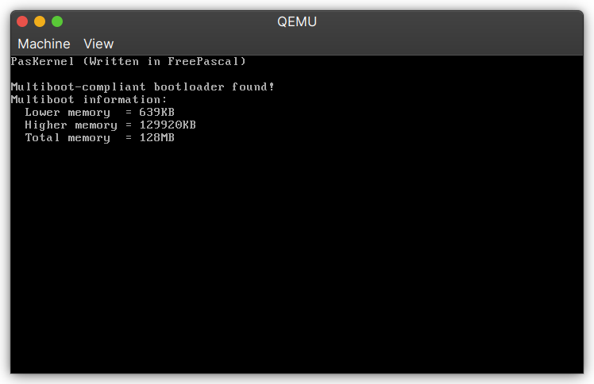

# PasKernel

A demo kernel based off of [OSDev FreePascal Barebones](https://wiki.osdev.org/Pascal_Bare_Bones)

## Building

### Prerequisties

- `fpc` which you can install from <http://freepascal.org/download.html>)
- `make` which should be already installed on Linux
- `i686-elf-ld` or you can use the `ld` bundled with your compiler (not tested)
- `grub-mkrescue` should be already installed in your system if you're using Linux (I don't know about Windows and macOS though)

Building the kernel is simple as cloning this repo and runnning:

```sh
make
```

## Screenshots

